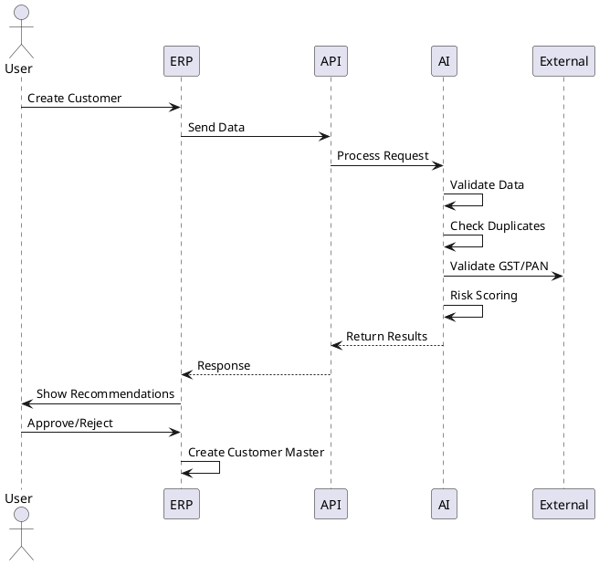

# SPEC-1-Agentic AI Customer Master Architecture

## Background

The current Customer Master process in ERP systems is largely manual and prone to duplicate records, missing compliance data, and lack of credit risk visibility. This results in inefficiencies across sales, finance, and billing workflows.

To address this, we propose an Agentic AI-based Customer Master Intelligence Layer integrated with the ERP. This layer will automate validation, detect duplicates, assess credit risk, and continuously monitor customer data quality.

Goal: Build a clean, compliant, and risk-aware customer master system to improve downstream business processes.

---

## Requirements

### Must Have

- Customer onboarding validation (mandatory fields, format checks)
- Statutory & tax validation (GSTIN, PAN, address)
- Duplicate detection (exact + fuzzy)
- Credit risk scoring during onboarding
- Approval workflow (risk-based)
- Customer master creation in ERP
- Full audit trail

### Should Have

- AI-based data enrichment
- Explainable AI outputs
- Role-based dashboards
- Continuous data monitoring
- Alerts for inconsistencies

### Could Have

- External credit bureau integration
- Predictive payment behavior
- Smart merge suggestions

### Won’t Have

- Order processing
- Pricing/discount logic
- Collections execution

---

## Method

### Architecture Overview

```
[User / Sales / Finance]
          ↓
   ERP System
          ↓
   API Gateway
          ↓
---------------------------------
|  Agentic AI Service Layer      |
|-------------------------------|
| Validation Engine             |
| Duplicate Detection Engine    |
| Risk Scoring Engine           |
| Compliance Engine             |
| Learning Module               |
---------------------------------
          ↓
 External APIs / Data Sources
          ↓
   ERP Database (Master Data)
```

---

### Component Design

#### ERP System

- Initiates customer onboarding
- Handles approval workflows
- Stores final master data

#### API Gateway

- Authentication & routing
- Decouples ERP and AI services

#### Agentic AI Layer

1. Validation Engine

- Field validation
- Format checks

2. Duplicate Detection

- Fuzzy matching (name, email, phone)
- Similarity scoring

3. Risk Scoring Engine

- Rule-based + ML scoring
- Outputs risk category + credit limit

4. Compliance Engine

- GST/PAN validation
- Address verification

5. Learning Module

- Learns from payment delays, overrides
- Improves scoring over time

---

### Sequence Diagram



## Gathering Results

- Measure onboarding time reduction
- Track duplicate rate reduction
- Monitor credit risk incidents
- Evaluate data completeness score
- User feedback from sales/finance teams

---

##

